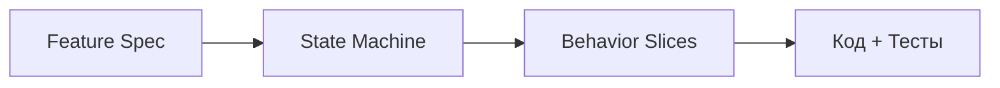

# Mobile App Architecture Framework (AI-ready)

Набор шаблонов архитектурной документации для мобильных приложений, которые остаются управляемыми, масштабируются по команде и функциональности и корректно разрабатываются с участием ИИ.

Документы фреймворка — не «документация ради документации», а **управляющие артефакты**, которые ограничивают сложность и снижают энтропию системы.

---

## Ключевая идея

Мобильные приложения страдают не от сложности кода, а от размытых границ, неявных решений и неформализованного поведения UI. При использовании ИИ эти проблемы усиливаются: ИИ вынужден догадываться и «додумывать» поведение без явных контрактов.

Фреймворк разделяет **архитектуру** (границы и правила), **поведение** (что система делает), **реализацию** (как это написано) и **разработку** (в каком порядке это делать) — и фиксирует каждый аспект в отдельном, связанном артефакте.

Центральный элемент подхода — **Behavior Slice**: минимальный вертикальный срез поведения, проходящий через все слои, имеющий наблюдаемый результат и пригодный для приёмки. Это идеальная единица работы для ИИ.

---

## Навигация по фреймворку

### Архитектура

| Документ | Описание |
|---|---|
| [Architecture Overview](docs/architecture/overview.md) | Общий обзор системы (C4-модель), границы, принципы, нефункциональные требования |
| [Module Boundaries](docs/architecture/module-boundaries.md) | Структура модулей, правила зависимостей между слоями |
| [ADR Template](docs/architecture/adr/_template_adr.md) | Шаблон Architecture Decision Record |

### Проектирование фич

| Документ | Описание |
|---|---|
| [Feature Spec Template](docs/features/_templates/feature.md) | Шаблон спецификации фичи: цель, сценарии, экраны, use cases, домен, кеш, деградация |
| [Behavior Slices Template](docs/features/_templates/behavior_slices.md) | Шаблон нарезки фичи на минимальные вертикальные срезы поведения |
| [Screen State Machine Template](docs/screens/_template_screen_state_machine.md) | Шаблон конечного автомата экрана: состояния, действия, эффекты, переходы |

### Контракты

| Документ | Описание |
|---|---|
| [API Contracts](docs/contracts/api.md) | Контракты взаимодействия с Backend: операции, маппинг DTO/Domain, ошибки |
| [Error Model & UI Policy](docs/contracts/errors.md) | Единая модель ошибок и политика их отображения в UI |
| [Golden Samples](docs/contracts/golden_samples/_README.md) | Эталонные JSON-ответы API для contract-тестов |

### Навигация, качество, эксплуатация, релиз

| Документ | Описание |
|---|---|
| [Navigation & Routes](docs/navigation/routes.md) | Маршруты, deeplinks, авторизационный gating |
| [Test Strategy](docs/quality/test_strategy.md) | Пирамида тестов, Definition of Done, матрица покрытия |
| [Quality Gates](docs/quality/quality_gates.md) | Обязательные проверки в CI: линтинг, тесты, правила зависимостей |
| [Observability](docs/ops/observability.md) | Логирование, метрики, трейсы, PII-политика |
| [Release Process](docs/release/release_process.md) | Версионирование, feature flags, чеклист релиза |

### Мета и инструменты

| Документ | Описание |
|---|---|
| [Дорожная карта проектирования](docs/ROADMAP_design.md) | Пошаговый процесс из 6 этапов с acceptance criteria для каждого шага |
| [Implementation Hints Template](docs/implementation_hints_template.md) | Примеры заполнения подсказок для ИИ-генерации кода |
| [Validation Rules](docs/validation_rules.md) | Правила валидации структуры и трассировки документов |
| [Traceability System](docs/_meta/traceability.md) | Описание системы трассировки между артефактами |
| [Artifact Registry](docs/_meta/artifacts.md) | Центральный реестр артефактов с идентификаторами и связями |
| [JSON-схемы](docs/schemas/) | Схемы валидации для Feature Spec, Behavior Slice и State Machine |
| [Скрипт валидации](scripts/validate_docs.py) | Автоматическая проверка структуры и связей документов |

---

## Быстрый старт

1. **Архитектурные рамки** (один раз на проект) -- заполните [Architecture Overview](docs/architecture/overview.md), [Module Boundaries](docs/architecture/module-boundaries.md) и примите 1-2 ключевых ADR.
2. **Первая фича** -- создайте спецификацию по шаблону [Feature Spec](docs/features/_templates/feature.md); для сложных экранов добавьте [State Machine](docs/screens/_template_screen_state_machine.md).
3. **Behavior Slices** -- нарежьте фичу на минимальные срезы поведения по шаблону [Behavior Slices](docs/features/_templates/behavior_slices.md) и передавайте их в разработку (в том числе ИИ).

Подробная пошаговая инструкция с acceptance criteria для каждого этапа -- в [Дорожной карте проектирования](docs/ROADMAP_design.md).

---

## Рекомендации по использованию

### Когда фреймворк особенно полезен

- Сложные главные экраны (много секций, деградация, кеш).
- Продуктовая разработка с частыми изменениями требований.
- Распределённые команды, которым нужен единый источник правды.
- Активное использование ИИ в разработке (code generation, refactoring, tests).
- Долгоживущие приложения (2-5 лет).

### Практические советы

- **Не заполняйте всё сразу.** Начните с архитектурных рамок и первой фичи. Остальные документы добавляйте по мере необходимости.
- **Behavior Slice -- главный ориентир.** Именно он связывает проектирование с реализацией и задаёт границы для ИИ.
- **Документы должны оставаться живыми.** Обновляйте их при изменении требований. Неактуальный документ хуже его отсутствия.
- **Лучше меньше, но конкретно.** Не все шаблоны обязательны для каждой фичи -- используйте то, что приносит пользу.
- **Валидируйте документы.** Запускайте `python scripts/validate_docs.py` локально и в CI, чтобы поддерживать консистентность связей и структуры.

---

## Принципы подхода

1. **Feature как единица ответственности** -- область пользовательской ценности, а не экран и не слой.
2. **Слои как ограничение свободы** -- `ui -> presentation -> domain -> data` -- регламент, а не рекомендация.
3. **Поведение важнее структуры** -- UI проектируется через состояния и переходы (state machine), а не через флаги.
4. **Явные контракты вместо договорённостей** -- API, ошибки, кеш, деградация зафиксированы в документах.
5. **Вертикали поведения вместо абстрактных user stories** -- разработка идёт через Behavior Slices.
6. **Тестируемость как критерий готовности** -- если правило нельзя проверить тестом, оно недостаточно формализовано.
