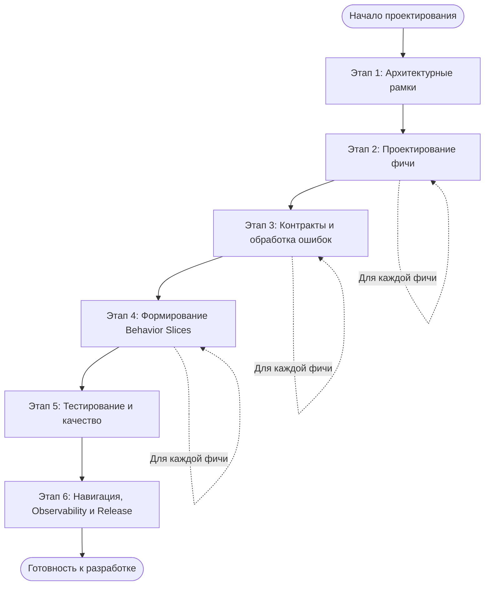
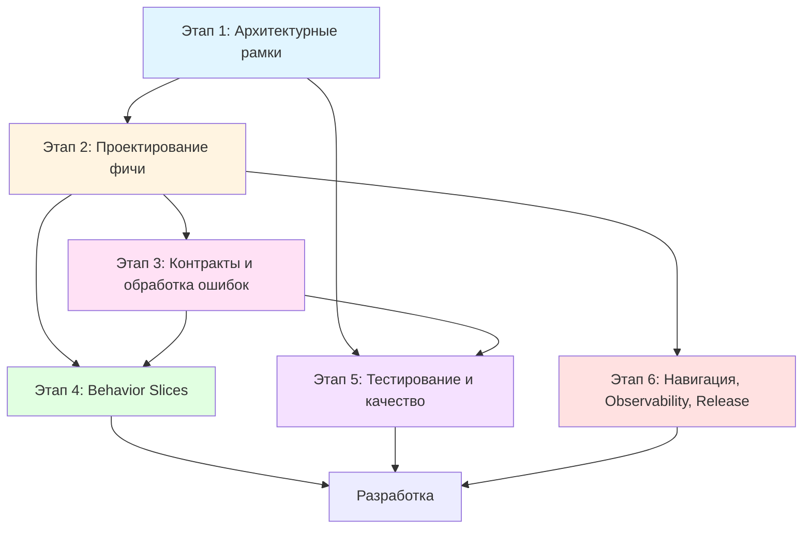

# Дорожная карта проектирования приложения

Этот документ описывает пошаговый процесс проектирования мобильного приложения с использованием шаблонов архитектурной документации.

## Обзор процесса

Процесс проектирования разбит на 6 этапов, каждый из которых создаёт конкретные артефакты и имеет чёткие критерии приёмки.

---

## Этап 1: Архитектурные рамки (один раз на проект)

**Цель этапа:** Установить архитектурные границы, принципы и правила, которые будут применяться ко всему проекту.

### Шаг 1.1: Architecture Overview

**Артефакт:** [`docs/architecture/overview.md`](architecture/overview.md)

**Исходные данные:**
- Требования к продукту (PRD, Product Vision)
- Технические ограничения (платформы, версии ОС)
- Интеграции с внешними системами (Backend API, Analytics, Push-уведомления)
- Нефункциональные требования (производительность, безопасность, надёжность)

**Где брать:**
- Встречи с продукт-менеджером
- Техническое задание
- Документация внешних API
- Требования безопасности и compliance

**Acceptance Criteria:**
- [ ] Описаны все внешние системы и их назначение
- [ ] Определены границы мобильного приложения
- [ ] Зафиксированы архитектурные принципы (слои, зависимости)
- [ ] Описаны нефункциональные требования
- [ ] Документ понятен новым членам команды

---

### Шаг 1.2: Module Boundaries

**Артефакт:** [`docs/architecture/module-boundaries.md`](architecture/module-boundaries.md)

**Исходные данные:**
- Структура проекта (решение о монорепозитории или отдельных репозиториях)
- Выбранная архитектура (Clean Architecture, MVVM, MVI и т.д.)
- Требования к изоляции модулей

**Где брать:**
- Техническое решение команды
- Существующая структура проекта (если есть)
- Опыт команды с предыдущими проектами

**Acceptance Criteria:**
- [ ] Определена структура директорий проекта
- [ ] Зафиксированы правила зависимостей между слоями
- [ ] Описаны правила взаимодействия между features
- [ ] Указаны инструменты для проверки соблюдения правил
- [ ] Правила можно автоматически проверить (линтеры/CI)

---

### Шаг 1.3: Архитектурные решения (ADR)

**Артефакт:** [`docs/architecture/adr/ADR-0001-*.md`](architecture/adr/_template_adr.md) (несколько ADR)

**Исходные данные:**
- Ключевые технические решения, требующие обоснования
- Альтернативные варианты решения
- Последствия выбора

**Где брать:**
- Технические дискуссии в команде
- Обсуждения на архитектурных ревью
- Вопросы, возникающие при проектировании фич

**Ключевые ADR для начала проекта:**
- Стиль UI (Compose/SwiftUI, навигация)
- Обработка ошибок (единая модель)
- Стратегия кеширования
- Подход к тестированию

**Acceptance Criteria:**
- [ ] Создано минимум 2-3 ключевых ADR
- [ ] Каждое ADR содержит контекст, решение и последствия
- [ ] ADR приняты командой (Status: Accepted)
- [ ] ADR связаны с соответствующими документами (overview, contracts)

---

## Этап 2: Проектирование фичи

**Цель этапа:** Детально описать поведение фичи, её экраны, use cases и доменную модель.

**Примечание:** Этот этап повторяется для каждой новой фичи.

### Шаг 2.1: Feature Spec

**Артефакт:** [`docs/features/<feature-name>.md`](features/_templates/feature.md)

**Исходные данные:**
- User Stories из бэклога продукта
- Дизайн-макеты экранов (Figma, Sketch)
- Требования к бизнес-логике
- Требования к аналитике
- Требования к производительности

**Где брать:**
- Product Backlog
- Дизайн-система и макеты
- Встречи с дизайнерами
- Встречи с продуктовой командой
- Существующие аналогичные фичи (если есть)

**Acceptance Criteria:**
- [ ] Определена цель фичи и её границы (что вне scope)
- [ ] Описаны все пользовательские сценарии (User Stories)
- [ ] Перечислены все экраны и их секции/блоки
- [ ] Определены use cases (архитектурные)
- [ ] Описана доменная модель (сущности, ошибки)
- [ ] Определены источники данных (репозитории, API)
- [ ] Зафиксирована политика кеша и обновления
- [ ] Описана политика деградации при ошибках
- [ ] Перечислены события аналитики
- [ ] Сформулированы тестовые требования (Given/When/Then)

---

### Шаг 2.2: Screen State Machine (для сложных экранов)

**Артефакт:** [`docs/screens/<screen-name>_state_machine.md`](screens/_template_screen_state_machine.md)

**Исходные данные:**
- Feature Spec (раздел "Экраны и состав UI")
- Дизайн-макеты с состояниями (loading, error, empty, content)
- Требования к поведению при ошибках
- Требования к обновлению данных (pull-to-refresh, auto-refresh)

**Где брать:**
- Feature Spec (шаг 2.1)
- Дизайн-макеты с различными состояниями
- Обсуждения с дизайнерами о UX при ошибках
- Требования к производительности (когда показывать loading)

**Когда создавать:**
- Для экранов с множеством состояний (loading, error, empty, content, refreshing)
- Для экранов с сложной логикой переходов
- Для главных экранов приложения

**Acceptance Criteria:**
- [ ] Определены все состояния экрана
- [ ] Перечислены все действия/события (Actions/Intents)
- [ ] Описаны побочные эффекты (Effects)
- [ ] Заполнена таблица переходов (Given state → When event → Then state)
- [ ] Описаны правила деградации
- [ ] Определён минимальный набор unit-тестов для reducer/store
- [ ] State Machine покрывает все сценарии из Feature Spec

---

## Этап 3: Контракты и обработка ошибок

**Цель этапа:** Зафиксировать контракты взаимодействия с внешними системами и единую модель обработки ошибок.

### Шаг 3.1: API Contracts

**Артефакт:** [`docs/contracts/api.md`](contracts/api.md)

**Исходные данные:**
- OpenAPI/Swagger спецификация Backend API
- GraphQL schema (если используется)
- Документация внешних API
- Feature Spec (раздел "Источники данных")

**Где брать:**
- Backend команда (OpenAPI файлы, GraphQL schema)
- Документация внешних сервисов
- Postman коллекции
- Существующие интеграции (если есть)

**Acceptance Criteria:**
- [ ] Указан источник правды (OpenAPI, GraphQL schema, ссылка)
- [ ] Описаны все операции по фичам (request/response)
- [ ] Зафиксированы правила маппинга DTO ↔ Domain
- [ ] Описана единая модель ошибок (Transport → Domain mapping)
- [ ] Созданы golden samples для contract-тестов
- [ ] Указаны правила версионирования API

---

### Шаг 3.2: Error Model & UI Policy

**Артефакт:** [`docs/contracts/errors.md`](contracts/errors.md)

**Исходные данные:**
- API Contracts (раздел "Единая модель ошибок")
- Feature Spec (раздел "Политика деградации")
- Требования к UX при ошибках
- ADR по обработке ошибок (если есть)

**Где брать:**
- API Contracts (шаг 3.1)
- Feature Spec (шаг 2.1)
- Дизайн-гайдлайны по обработке ошибок
- Обсуждения с дизайнерами

**Acceptance Criteria:**
- [ ] Определён единый список Domain errors
- [ ] Заполнена таблица политики отображения в UI (Domain error → UI behavior → Retry → CTA)
- [ ] Описана политика логирования и аналитики ошибок
- [ ] Политика согласована с дизайнерами
- [ ] Политика покрывает все типы ошибок из API Contracts

---

### Шаг 3.3: Golden Samples

**Артефакт:** [`docs/contracts/golden_samples/<feature>_<operation>.json`](contracts/golden_samples/_README.md)

**Исходные данные:**
- API Contracts (request/response структуры)
- Примеры ответов от Backend API
- Тестовые данные

**Где брать:**
- Реальные ответы API (из Postman, браузера, логов)
- Тестовые данные от Backend команды
- Примеры из документации API

**Acceptance Criteria:**
- [ ] Создан golden sample для каждой операции API
- [ ] Golden samples покрывают успешные ответы
- [ ] Golden samples покрывают основные типы ошибок
- [ ] Файлы названы по конвенции: `<feature>_<operation>.json`
- [ ] Golden samples используются в contract-тестах

---

## Этап 4: Формирование Behavior Slices

**Цель этапа:** Разбить фичу на минимальные вертикальные срезы поведения для управляемой разработки.

### Шаг 4.1: Behavior Slices

**Артефакт:** [`docs/features/<feature-name>/behavior_slices.md`](features/_templates/behavior_slices.md)

**Исходные данные:**
- Feature Spec (все разделы)
- Screen State Machine (если есть)
- User Stories из Feature Spec
- Приоритеты фичи

**Где брать:**
- Feature Spec (этап 2.1)
- Screen State Machine (этап 2.2, если создан)
- Product Backlog (приоритеты)
- Обсуждения с командой о порядке разработки

**Acceptance Criteria:**
- [ ] Каждый Behavior Slice минимален и завершён
- [ ] Каждый slice имеет чёткий scope и out of scope
- [ ] Определены Context (предусловия) и Trigger (событие)
- [ ] Описано Expected Behavior
- [ ] Указано State Coverage (какие состояния покрываются)
- [ ] Описаны Degradation Rules
- [ ] Сформулированы Acceptance Criteria (Given/When/Then)
- [ ] Указаны связанные артефакты (Feature Spec, State Machine, API Contract)
- [ ] Slices покрывают все User Stories из Feature Spec
- [ ] Slices упорядочены по приоритету (P0, P1, P2)

---

## Этап 5: Тестирование и качество

**Цель этапа:** Определить стратегию тестирования и настройки quality gates для поддержания качества кода.

### Шаг 5.1: Test Strategy

**Артефакт:** [`docs/quality/test_strategy.md`](quality/test_strategy.md)

**Исходные данные:**
- Архитектурные принципы (из overview.md)
- Структура модулей (из module-boundaries.md)
- Требования к покрытию тестами
- Опыт команды с тестированием

**Где брать:**
- Architecture Overview (этап 1.1)
- Module Boundaries (этап 1.2)
- Требования проекта к качеству
- Best practices команды

**Acceptance Criteria:**
- [ ] Определена пирамида тестов (целевые доли: Unit, Contract, Integration, E2E)
- [ ] Описаны минимальные требования (Definition of Done)
- [ ] Заполнена матрица покрытия (Artefact → Test type → Location)
- [ ] Стратегия покрывает все слои архитектуры
- [ ] Определены критерии готовности фичи к приёмке

---

### Шаг 5.2: Quality Gates

**Артефакт:** [`docs/quality/quality_gates.md`](quality/quality_gates.md)

**Исходные данные:**
- Module Boundaries (правила зависимостей)
- Test Strategy (требования к тестам)
- Инструменты линтинга и статического анализа
- CI/CD pipeline

**Где брать:**
- Module Boundaries (этап 1.2)
- Test Strategy (шаг 5.1)
- Настройки проекта (Gradle, SwiftPM, package.json)
- CI конфигурация

**Acceptance Criteria:**
- [ ] Перечислены все обязательные проверки (format/lint, unit tests, contract tests, dependency rules)
- [ ] Описаны правила архитектуры, которые проверяются автоматически
- [ ] Указано, где настраиваются проверки (Gradle/SwiftPM, CI pipeline)
- [ ] Quality gates настроены в CI и блокируют merge при нарушениях
- [ ] Правила можно проверить локально перед коммитом

---

## Этап 6: Навигация, Observability и Release

**Цель этапа:** Зафиксировать правила навигации, observability и процесс релиза.

### Шаг 6.1: Navigation & Deeplinks

**Артефакт:** [`docs/navigation/routes.md`](navigation/routes.md)

**Исходные данные:**
- Feature Spec (все фичи и их экраны)
- Требования к deep linking
- Требования к авторизации (какие экраны требуют auth)
- Маркетинговые ссылки

**Где брать:**
- Feature Spec всех фич (этап 2.1)
- Требования к маркетингу (deep links для промо-кампаний)
- Требования безопасности (авторизация)
- Существующая навигация (если есть)

**Acceptance Criteria:**
- [ ] Заполнена таблица Routes (Route → Params → Auth required → Owner feature)
- [ ] Описаны все Deeplinks (Deeplink → Parsed route → Notes)
- [ ] Зафиксированы правила авторизационного gating
- [ ] Описана обработка неизвестных маршрутов
- [ ] Все экраны из Feature Spec имеют соответствующие routes

---

### Шаг 6.2: Observability

**Артефакт:** [`docs/ops/observability.md`](ops/observability.md)

**Исходные данные:**
- Feature Spec (раздел "Аналитика")
- Требования к мониторингу производительности
- Требования к логированию
- Инструменты аналитики (Firebase, Amplitude, и т.д.)

**Где брать:**
- Feature Spec (раздел аналитики, этап 2.1)
- Требования к мониторингу от DevOps
- Политика безопасности (PII policy)
- Инструменты аналитики, используемые в проекте

**Acceptance Criteria:**
- [ ] Определены уровни логирования (debug/info/warn/error)
- [ ] Зафиксирована PII policy (что нельзя логировать)
- [ ] Описана корреляция запросов (requestId)
- [ ] Перечислены ключевые метрики (time_to_first_content, error_rate, и т.д.)
- [ ] Описаны алерты и дашборды
- [ ] Observability покрывает все события аналитики из Feature Spec

---

### Шаг 6.3: Release Process

**Артефакт:** [`docs/release/release_process.md`](release/release_process.md)

**Исходные данные:**
- Процесс разработки команды (ветки, workflow)
- Требования к версионированию
- Стратегия feature flags
- Требования к changelog

**Где брать:**
- Git workflow команды
- Требования к версионированию (Semantic Versioning, и т.д.)
- Стратегия rollout (постепенный релиз, A/B тесты)
- Требования продукта к changelog

**Acceptance Criteria:**
- [ ] Описана стратегия версионирования (App version, API version)
- [ ] Зафиксированы правила обратной совместимости
- [ ] Описан процесс релиза (ветки, теги, чеклист)
- [ ] Определена стратегия feature flags и rollout
- [ ] Описан формат и место ведения changelog
- [ ] Процесс понятен всем членам команды

---

## Визуализация зависимостей между этапами

---

## Чеклист готовности к разработке

Перед началом разработки фичи убедитесь, что:

- [ ] Завершён Этап 1 (архитектурные рамки)
- [ ] Создан Feature Spec для фичи
- [ ] Создан Screen State Machine (если требуется)
- [ ] Описаны API Contracts для фичи
- [ ] Зафиксирована Error Model & UI Policy
- [ ] Созданы Behavior Slices для фичи
- [ ] Настроены Quality Gates
- [ ] Обновлены Navigation & Routes (если добавлены новые экраны)
- [ ] Обновлена Observability (если добавлены новые события)

---

## Примечания

- **Этап 1** выполняется один раз на проект в начале
- **Этапы 2-4** повторяются для каждой новой фичи
- **Этап 5** настраивается один раз, но может обновляться по мере развития проекта
- **Этап 6** обновляется по мере добавления новых фич и требований

Документы должны оставаться **живыми** — обновляться при изменении требований и поведения системы.

