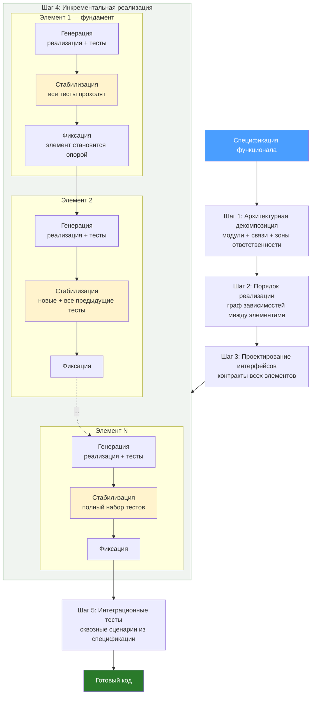

# Разработка качественного кода с помощью ИИ-агента

## Введение

Идея ИИ разработки проста: вы описываете, что нужно, ИИ-агент пишет код, и этот код работает. Без часов отладки, без "почти правильно, но...".

Это достижимо — но не за счёт одного удачного промпта. Результат определяется тем, как вы организуете процесс: от подготовки спецификации до финальной интеграции. Эта статья описывает подход, который позволяет систематически получать работающий код с минимальными затратами на отладку.

---

## 1. Подготовка: что нужно до начала генерации

### 1.1. Точная спецификация

Агент генерирует ровно настолько хорошо, насколько точно вы описали задачу. Помимо функциональных требований спецификация должна содержать:

- Язык, фреймворк, целевая платформа
- Существующие зависимости и ограничения
- Входные и выходные данные
- Граничные случаи и ожидаемое поведение при ошибках
- Стиль кода: naming conventions, принятые паттерны

Обратите внимание: спецификация, включающая эти аспекты — это уже архитектурный артефакт. Она фиксирует не только *что* должен делать код, но и *в каких рамках* он существует: платформа, зависимости, контракты, стилевые конвенции. Именно эти рамки позволяют агенту генерировать код, который встраивается в проект, а не просто "работает сам по себе".

Эта связь между спецификацией и архитектурой проходит через весь процесс: архитектурная декомпозиция (Шаг 1) опирается на спецификацию, интерфейсы (Шаг 3) детализируют её, а малые порции для генерации (раздел 5) являются её архитектурными элементами.

### 1.2. Контекст проекта

Агент работает заметно лучше, когда видит реальный код проекта, а не работает "в вакууме". Для этого он должен видеть:

- существующие модули, с которыми нужна интеграция;
- архитектурные решения и конвенции проекта;
- интерфейсы и типы данных, которые уже определены.

Практическим инструментом для выполнения этих условий являются правила проекта, в которых зафиксированы стек, правила, конвенции. Агент должен читать их в начале каждой сессии и учитывать при генерации.

---

## 2. Влияние объёма на качество

Здесь кроется главная ловушка: кажется, что чем больше кода попросить за раз, тем быстрее получишь результат. На практике всё наоборот — чем больше кода за один промпт, тем выше вероятность ошибок: рассогласования интерфейсов, забытые зависимости, неверная логика на стыках модулей.

Почему так? Каждый следующий сгенерированный токен несёт накопленную вероятность ошибки. Чем длиннее генерация, тем больше эта вероятность — это следствие самой архитектуры языковых моделей.

В различных источниках можно найти ориентировочную зависимость качества кода от объёма:

- **Малый объём** (функция, класс, модуль до ~200 строк) — качество высокое. Агент удерживает весь контекст, результат часто работает сразу.
- **Средний объём** (~200–1000 строк, несколько связанных модулей) — качество хорошее, но появляются рассогласования между частями: несовпадения интерфейсов, забытые зависимости.
- **Большой объём** (1000+ строк, целая фича или подсистема) — качество падает заметно. Растёт количество неявных связей и вероятность ошибок в деталях.

> **Важно** уточнить. что приведённые пороги — ориентировочные, не научные. Качество зависит не только от объёма, но и от сложности логики, количества зависимостей и точности спецификации. Тем не менее закономерность устойчива: чем больше кода генерится за один промпт, тем больше времени уйдёт на его отладку.

**Практический вывод:** сложный функционал необходимо разбивать на малые порции и генерировать итеративно.

---

## 3. Два подхода: когда какой применять

### Подход А: генерация "с одного промпта"

Весь код фичи запрашивается за один раз.

- **Плюсы:** быстро получаете первый результат
- **Минусы:** непредсказуемое качество, потенциально долгая отладка
- **Когда применять:** простые фичи с одним модулем, малым числом зависимостей и ясной логикой

### Подход Б: итеративное выращивание

Код создаётся малыми порциями, каждая проверяется перед переходом к следующей.

- **Плюсы:** предсказуемый результат, минимальная отладка
- **Минусы:** больше времени на процесс генерации
- **Когда применять:** средние и сложные фичи с несколькими модулями и зависимостями

### Как выбрать

- Фича укладывается в одну ясную просьбу — подход А.
- Есть сомнения, сработает ли с первого раза — подход Б.
- Подход А дал нерабочий код — не чините серией дополнительных промптов, перейдите к декомпозиции (подход Б). Попытка починить сломанный результат серией промптов-заплаток — самая частая ошибка. Обычно это занимает больше времени, чем переделка с нуля по итеративному подходу.

---

## 4. Малые порции — это элементы архитектуры

Прежде чем описывать процесс, важно разобраться с природой этих "малых порций". Возникает соблазн думать о них как о задачах: "сначала сделаем вот это, потом вот это". Но это не задачи — это **полноценные архитектурные элементы**. Каждая порция должна быть спроектирована:

1. **Зона ответственности** — за что элемент отвечает, за что не отвечает
2. **Контракт** — интерфейс взаимодействия с элементом
3. **Зависимости** — что нужно для работы
4. **Место в целом** — как встраивается в общую структуру

В чём разница? Если вы просто "нарезали" фичу на куски — получите фрагменты, которые непонятно как тестировать по отдельности и которые могут не сойтись при сборке. Если каждый кусок спроектирован как архитектурный элемент — его можно реализовать изолированно, протестировать отдельно и гарантированно интегрировать в систему.

Это означает, что проектирование интерфейсов выполняется до реализации: к моменту генерации кода каждый элемент уже спроектирован. Как именно это встраивается в процесс — расскажем ниже.

### Критерии правильного размера порции

**Порция нормального размера:**

- Один класс или одна функция с ясной ответственностью
- 1–3 зависимости от других модулей
- Покрывается 3–7 тестами
- Промпт для генерации помещается в один абзац

**Порция слишком крупная:**

- Промпт описывает несколько несвязанных поведений
- Нужно мокать больше 2–3 зависимостей для тестов
- Результат нельзя проверить глазами за 30 секунд

**Порция слишком мелкая:**

- Не имеет смысла без соседней порции
- Тест для неё тривиален до бессмысленности
- Формулировка промпта занимает больше времени, чем генерация

---

## 5. Процесс итеративной разработки

### Шаг 1. Архитектурная декомпозиция

Входные данные: спецификация функционала. Поскольку спецификация уже содержит архитектурные решения (платформа, зависимости, контракты), декомпозиция не начинается с нуля — она детализирует и структурирует то, что заложено в спецификации.

Задача: определить, какие модули и классы нужны, как они взаимодействуют, какие у них зоны ответственности. На этом шаге код не пишется — только структура.

### Шаг 2. Определение порядка реализации

Задача: выстроить модули в порядке реализации, начиная с тех, у которых минимум зависимостей. Для каждого модуля фиксируются: входные/выходные данные, зависимости, зависимые модули.

На этом же шаге определяется, нужно ли декомпозировать крупные модули на более мелкие архитектурные элементы (см. раздел 4 — критерии размера).

### Шаг 3. Проектирование интерфейсов и контрактов

Задача: написать интерфейсы, протоколы и типы данных для всех модулей. Без реализации — только контракты.

Это критический шаг. Когда контракты зафиксированы, каждый модуль можно реализовывать изолированно с гарантией, что он состыкуется с остальными. Если пропустить этот шаг или сделать его формально — на этапе интеграции вас ждут сюрпризы.

### Шаг 4. Инкрементальная реализация

Это ключевой шаг процесса. Функционал выращивается поэлементно: каждый следующий архитектурный элемент добавляется к уже работающему и стабилизированному коду.

Цикл для каждого элемента из очереди реализации:

1. **Генерация** — агент реализует элемент и unit-тесты к нему. Агент видит уже реализованные элементы и зафиксированные интерфейсы, что обеспечивает согласованность.
2. **Стабилизация** — запуск тестов: как новых (для текущего элемента), так и существующих (для ранее реализованных). Если что-то не проходит — исправление до полной стабильности.
3. **Фиксация** — только после стабилизации элемент считается готовым и становится опорой для следующего.

Принцип: на каждом шаге система остаётся в работающем состоянии. Новый элемент не добавляется, пока предыдущий инкремент не стабилизирован. Это исключает накопление ошибок — ту самую проблему, которая делает подход "с одного промпта" непредсказуемым.

### Шаг 5. Интеграция

Когда все элементы реализованы и стабилизированы — написание интеграционных тестов, проверяющих сквозные сценарии из спецификации. Поскольку каждый элемент уже проверен изолированно, интеграция сводится к проверке взаимодействия, а не к поиску багов в реализации.

### Визуализация процесса

---

## 6. Принципы стратегии тестирования

При инкрементальном подходе тестирование — не отдельная фаза "после разработки". Оно вплетено в каждый инкремент и является частью самого процесса. Вот принципы, на которых строится стратегия.

### 6.1. Тесты генерируются вместе с кодом

Каждый архитектурный элемент генерируется вместе со своими unit-тестами в одном промпте. Это не дополнительный шаг — это часть определения "готовности" элемента. Элемент без тестов не считается реализованным и не может стать опорой для следующего инкремента.

### 6.2. Объём тестов нарастает вместе с кодом

При стабилизации каждого инкремента запускаются не только тесты нового элемента, но и все тесты ранее реализованных элементов. Это принципиальное отличие от подхода "написали всё — потом тестируем":

- После реализации элемента 1: запускаются тесты элемента 1
- После реализации элемента 2: запускаются тесты элементов 1 и 2
- После реализации элемента N: запускаются тесты всех N элементов

Если тест ранее стабилизированного элемента вдруг падает — значит, новый элемент нарушил контракт. Вы узнаёте об этом сразу, а не при финальной интеграции, когда искать причину в разы сложнее.

### 6.3. Уровни верификации соответствуют шагам процесса

Не всё проверяется автотестами. Каждый шаг процесса (раздел 5) имеет свой уровень верификации — и важно понимать, где работают тесты, а где нужна экспертная оценка:

- **Архитектура (Шаг 1)** — ревью: покрывают ли модули все требования спецификации, нет ли избыточных связей, соблюдён ли принцип единственной ответственности. Автотесты здесь невозможны — это экспертная оценка.
- **Интерфейсы (Шаг 3)** — проверка согласованности контрактов: совпадают ли типы на стыках модулей, нет ли противоречий. В типизированных языках это может частично проверяться компилятором.
- **Реализация (Шаг 4)** — unit-тесты каждого элемента. Проверяют поведение элемента изолированно, через его контракт.
- **Интеграция (Шаг 5)** — интеграционные тесты по сквозным сценариям из спецификации. Проверяют взаимодействие элементов, а не их внутреннюю логику.

### 6.4. Раннее обнаружение — дешёвое исправление

Ошибка в архитектуре, обнаруженная на этапе интеграции, может потребовать переделки всей цепочки. Ошибка в реализации элемента, пойманная при его стабилизации, исправляется локально и не затрагивает остальной код. Вся стратегия тестирования намеренно выстроена так, чтобы ошибки обнаруживались как можно раньше и как можно ближе к их источнику.

### 6.5. Тесты как спецификация поведения

У тестов есть ещё одна роль, менее очевидная. Unit-тесты архитектурного элемента фиксируют его ожидаемое поведение. Когда агент генерирует следующий элемент, он видит не только интерфейс предыдущего, но и его тесты — а значит, понимает не только *что* элемент делает, но и *как* он себя ведёт в граничных случаях. Это повышает качество генерации зависимых элементов.

---

## Заключение

Качественная генерация кода с помощью ИИ-агента — это не вопрос удачного промпта. Это процесс, в котором:

1. Спецификация точно зафиксирована и агенту предоставлен полный контекст проекта
2. Сложность управляется через декомпозицию на архитектурные элементы
3. Каждый элемент спроектирован до генерации — с контрактом, ответственностью и зависимостями
4. Реализация идёт инкрементально — от фундамента к вершине, со стабилизацией на каждом шаге
5. Тестирование встроено в процесс, а не является отдельной фазой

Такой подход требует больше дисциплины, чем генерация "с одного промпта". Но он даёт предсказуемый результат и минимизирует время отладки — а это именно то, ради чего всё это затевалось.
